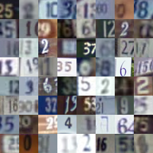
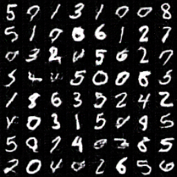

# Unsupervised Cross-domain Image Generation with Generative Adversarial Network

A course project of *Advanced Application of Machine Learning* at Tsinghua University in the fall semester of 2016.

A (not very successful) implementation of [Y. Taigman, A. Polyak & L. Wolf (2016). Unsupervised Cross-domain Image Generation. ICLR 2017](https://arxiv.org/abs/1611.02200). It cannot fully reproduce the reported experimental result. Don't use this code for research, production or any other serious purpose.

## What it does

Convert images into another style, without any information about correspondence. See the original paper as well as our reports for technical details.

From this:



to this:



Cool, right?

## Requirements

* Tensorflow
* numpy & scipy
* six

## Datasets

* MNIST & SVHN: Well-known datasets used by the original paper, which we tried to reproduce. We use the original format. Just google and download.
* LookBook: For an additional experiment. Originally used in *D. Yoo, N. Kim, S. Park, A. S. Paek, I. S. Kweon, Pixel-Level Domain Transfer, ECCV 2016*. Download at [Author's website](https://dgyoo.github.io/).

## Usage

```shell
cd src
python train_TinyVGG.py # pretrain
python main.py # adversarial train
```

The code for experiment on LookBook dataset is incomplete and not runnable, because of file syncing issues in the team in the last few days of the project.